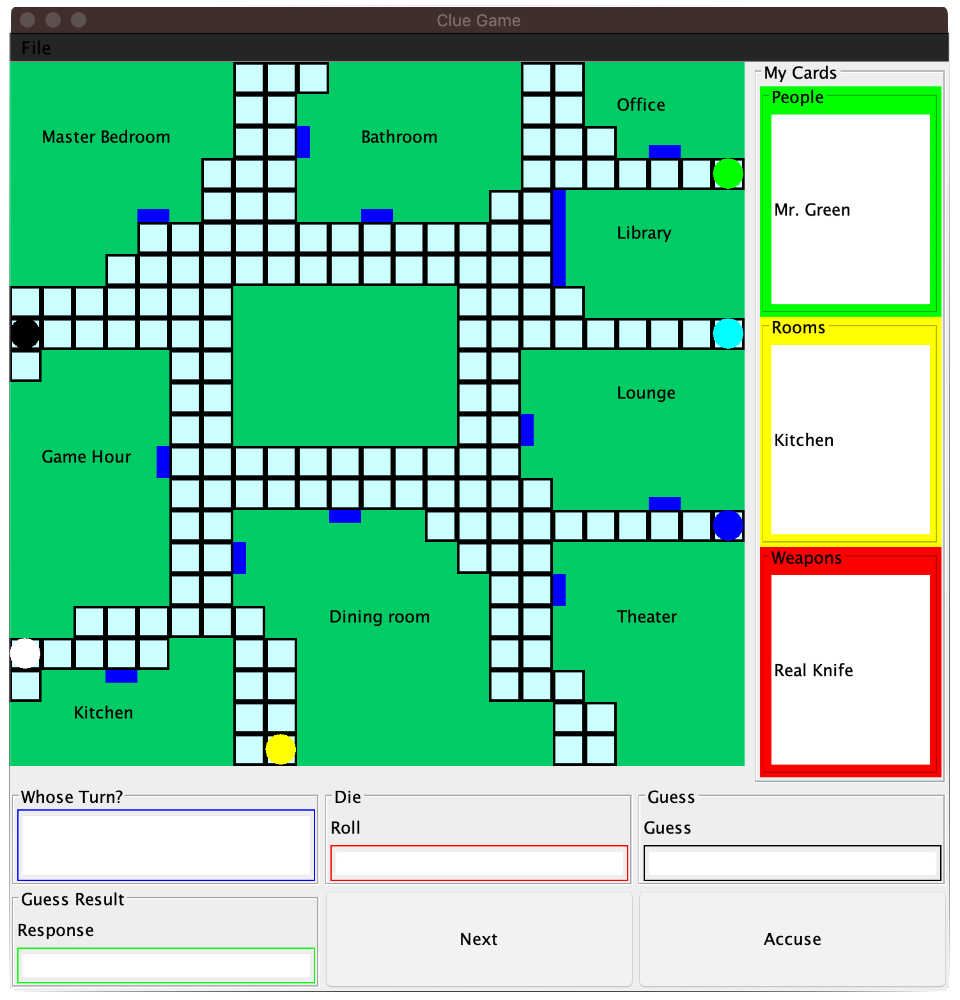

# Colorado School of Mines - CSCI 306 ClueGame Project
- Fall 2019

## About:
This was a big assignment for the Software Engineering class (CSCI 306) at the Colorado School of Mines, were we had to create 
the Clue Board Game using Java as well as create a GUI for this game using Java's JFrame. To learn how the rules work for this game, please checkout this link: https://en.wikipedia.org/wiki/Cluedo. This over all project was a massive learning experience for Java as a language, Object Oriented Programming, and developing with a partner/group. 

## Developers:
- Ruidi Huang (https://github.com/RuidiH)
- Mehmet Yilmaz (https://github.com/MehmetMHY)

## Requirements:
- Java
- JFrame

## Important:
There are quite a lot of flows with this project. The code is not clean, there are small bugs everywhere, the GUI looks like its from Windows 95, the overall structure of the code breaks nearly all of the coding principles, and the over all project did not end up as great as we thought it would. This was due to many things such as: lack of time due to our other classes, the way the class wanted us to structure our code, and our over all lack of experience. These are not excuses but we learned a lot from this project. Also towards the end of the class, we learned and applied a lot of coding principles which should help us in the future. Over all, this was a fun project and a great learning experience.

## Game Preview:

